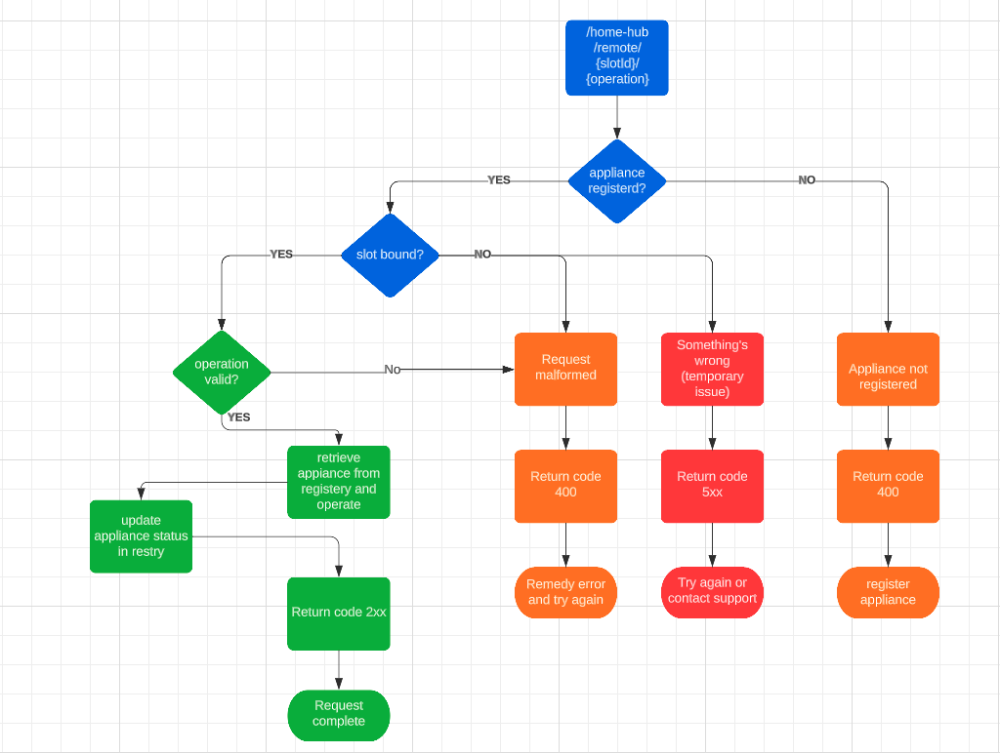

# HomeHubController

The `HomeHubController` class is a Spring Boot REST controller that handles various endpoints related to home automation and remote operations. It provides functionalities to register appliances, bind them to remote slots, operate appliances, and retrieve information about bound slots.
## Flow Diagram

## Documentation

The API documentation for the `HomeHubController` endpoints can be accessed using the OpenAPI specification. After starting the application, you can access the documentation at [swagger-ui](http://localhost:8080/swagger-ui.html).
You can execute the application via swagger UI or any other rest client like Postman could be used.
## Endpoints
With each endpoint a sample curl request will be provided here but easiest way to run is via swagger.
### GET /home-hub/remote/slots

This endpoint retrieves the list of bound slots of a remote.

http://0.0.0.0:8080/home-hub/remote/slots
### POST /home-hub/remote/{slotId}/appliance/{applianceName}

This endpoint is used to bind an appliance with a remote slot. It requires the `slotId` and `applianceName` as path parameters.

curl --location --request POST 'http://localhost:8080/home-hub/remote/3/appliance/lights'
### POST /home-hub/remote/{slotId}/{operation}

This endpoint is used to operate an appliance. It requires the `slotId` and `operation` as a path parameters (0 or 1) are possible values for operation.

curl --location --request POST 'http://localhost:8080/home-hub/remote/3/0'
### POST /home-hub/remote/undo

This endpoint is used to undo a previous operation.

curl --location --request POST 'http://localhost:8080/home-hub/remote/undo'
### POST /home-hub/appliances/{applianceName}

This endpoint is used to register a device/appliance with Home Hub server. Please be noted that an appliance/device needs to be registered first.

curl --location --request POST 'http://localhost:8080/home-hub/appliance/lights'
## Dependencies

The `HomeHubController` class depends on the following components:

- `RegisterApplianceService`: A service class that handles the registration and operations related to appliances.
- `MessageSource`: A component for retrieving localized messages.

## Build and Run

To build and run the project, ensure that you have Java and Maven installed on your system. Then, follow these steps:

1. Clone the repository.
2. Navigate to the project root directory.
3. Run the command `mvn clean install` to build the project.
4. Run the command `mvn spring-boot:run` to start the application.

